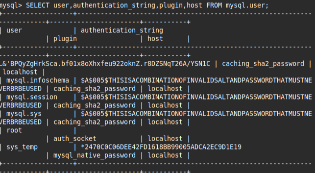
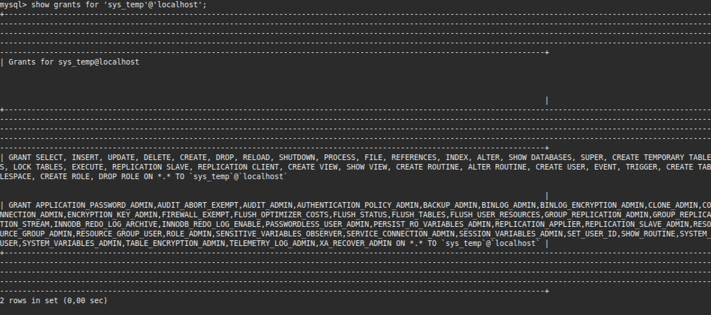
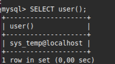
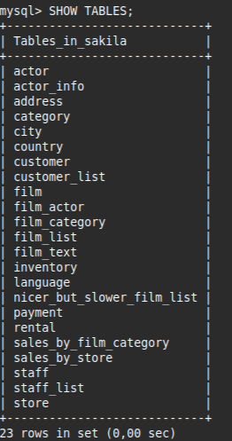

# Домашнее задание к занятию «Работа с данными (DDL/DML)» Филатов Олег

### Инструкция по выполнению домашнего задания

1. Сделайте fork [репозитория c шаблоном решения](https://github.com/netology-code/sys-pattern-homework) к себе в Github и переименуйте его по названию или номеру занятия, например, https://github.com/имя-вашего-репозитория/gitlab-hw или https://github.com/имя-вашего-репозитория/8-03-hw).
2. Выполните клонирование этого репозитория к себе на ПК с помощью команды `git clone`.
3. Выполните домашнее задание и заполните у себя локально этот файл README.md:
   - впишите вверху название занятия и ваши фамилию и имя;
   - в каждом задании добавьте решение в требуемом виде: текст/код/скриншоты/ссылка;
   - для корректного добавления скриншотов воспользуйтесь инструкцией [«Как вставить скриншот в шаблон с решением»](https://github.com/netology-code/sys-pattern-homework/blob/main/screen-instruction.md);
   - при оформлении используйте возможности языка разметки md. Коротко об этом можно посмотреть в [инструкции по MarkDown](https://github.com/netology-code/sys-pattern-homework/blob/main/md-instruction.md).
4. После завершения работы над домашним заданием сделайте коммит (`git commit -m "comment"`) и отправьте его на Github (`git push origin`).
5. Для проверки домашнего задания преподавателем в личном кабинете прикрепите и отправьте ссылку на решение в виде md-файла в вашем Github.
6. Любые вопросы задавайте в чате учебной группы и/или в разделе «Вопросы по заданию» в личном кабинете.

Желаем успехов в выполнении домашнего задания.

---

Задание можно выполнить как в любом IDE, так и в командной строке.

### Задание 1
1.1. Поднимите чистый инстанс MySQL версии 8.0+. Можно использовать локальный сервер или контейнер Docker.

1.2. Создайте учётную запись sys_temp. 

1.3. Выполните запрос на получение списка пользователей в базе данных. (скриншот)



1.4. Дайте все права для пользователя sys_temp. 

1.5. Выполните запрос на получение списка прав для пользователя sys_temp. (скриншот)



1.6. Переподключитесь к базе данных от имени sys_temp.

Для смены типа аутентификации с sha2 используйте запрос: 
```sql
ALTER USER 'sys_test'@'localhost' IDENTIFIED WITH mysql_native_password BY 'password';
```
1.6. По ссылке https://downloads.mysql.com/docs/sakila-db.zip скачайте дамп базы данных.



1.7. Восстановите дамп в базу данных.

1.8. При работе в IDE сформируйте ER-диаграмму получившейся базы данных. При работе в командной строке используйте команду для получения всех таблиц базы данных. (скриншот)




*Результатом работы должны быть скриншоты обозначенных заданий, а также простыня со всеми запросами.*
```bash
# ssh user@158.160.19.198 -i id_rsa
$ sudo -i
# apt update
# apt install mysql-server mysql-client
# mysqladmin password -u root -p
# mysql_secure_installation
# mysql -u root -p
mysql> CREATE USER 'sys_test'@'localhost' IDENTIFIED BY 'password';
mysql> SELECT user,authentication_string,plugin,host FROM mysql.user;
mysql> GRANT ALL PRIVILEGES ON *.* TO 'sys_test'@'localhost';
mysql> show grants for 'sys_test'@'localhost';
mysql> exit
# mysql -u sys_test -p
mysql> SELECT user();
mysql> exit
# wget https://downloads.mysql.com/docs/sakila-db.zip
# apt install unzip
# unzip sakila-db.zip
# mysql -u sys_test -p
mysql> CREATE DATABASE `sakila`;
mysql> SHOW DATABASES;
mysql> exit
# export DBNAME=sakila
# mysql -u sys_test -p ${DBNAME} < /root/sakila-db/sakila-schema.sql
# mysql -u sys_test -p ${DBNAME} < /root/sakila-db/sakila-data.sql
# mysql -u sys_test -p
mysql> SHOW DATABASES;
mysql> USE sakila;
mysql> SHOW TABLES;
```


### Задание 2
Составьте таблицу, используя любой текстовый редактор или Excel, в которой должно быть два столбца: в первом должны быть названия таблиц восстановленной базы, во втором названия первичных ключей этих таблиц. Пример: (скриншот/текст)
```
Название таблицы | Название первичного ключа
customer         | customer_id
```
